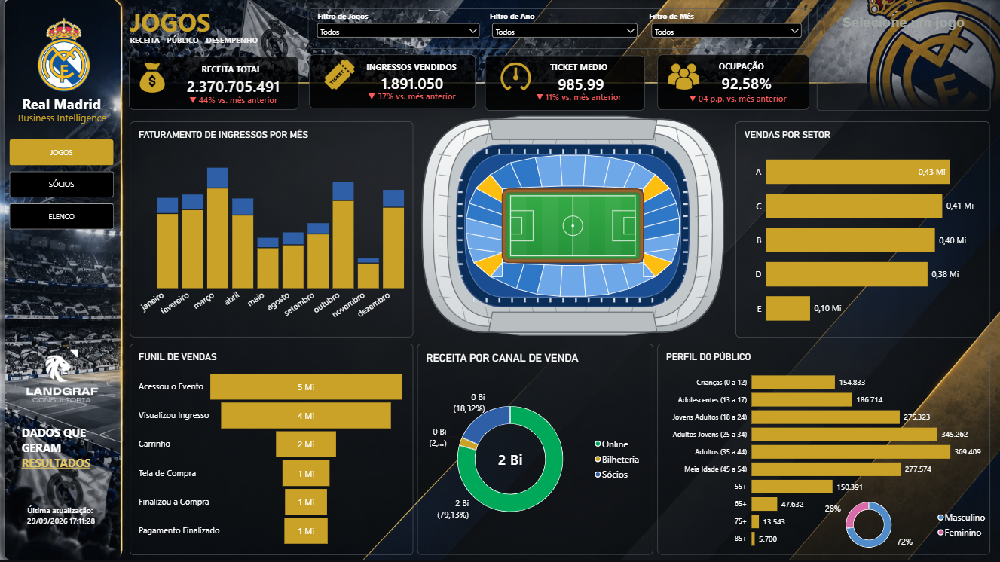
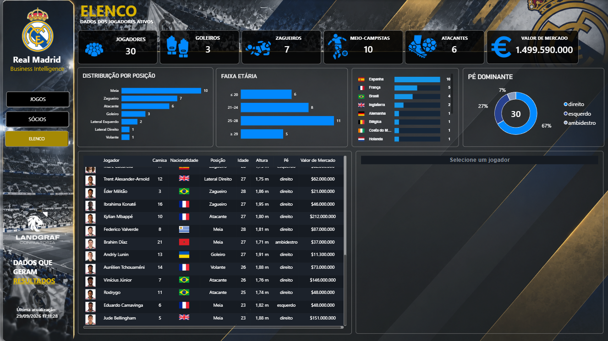
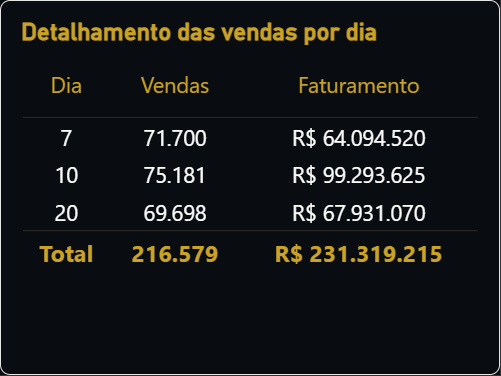

# Football Business Intelligence — Power BI

> A Power BI portfolio project focused on football business intelligence, combining matchday analytics, ticket sales, membership management and squad intelligence.

🇺🇸 **English:** Full project documentation is provided in English.  
🇧🇷 **Português:** O dashboard foi desenvolvido em português, enquanto a documentação técnica está disponível em inglês.

---

## Dashboard Preview

### 01 — Matchday Analytics



### 02 — Membership Analytics


### 03 — Squad Intelligence — Overview



### 04 — Squad Intelligence — Player Detail


### 05 — Interactive Daily Sales Tooltip



---

## Project Overview

This project explores how football club data can be transformed into a Business Intelligence environment designed to support operational and commercial analysis.

The solution combines matchday operations, ticket sales, membership analytics and squad intelligence into an integrated Power BI environment.

The project was developed as a portfolio case to demonstrate analytical thinking, data modeling, DAX development, Power Query transformations and advanced Power BI visualization techniques.

---

## Business Areas

### Matchday Analytics

The matchday section focuses on:

- Stadium occupancy
- Ticket sales
- Revenue by sales channel
- Revenue evolution
- Match-level performance
- Sector-level analysis

### Membership Analytics

The membership section provides analysis of:

- Membership base evolution
- Membership plans
- Membership revenue
- Cancellations
- Delinquency
- Plan composition

### Squad Intelligence

The squad section explores:

- Squad composition
- Player positions
- Nationalities
- Player profiles
- Player market value
- Dynamic player visualization
- Interactive player detail views

### Daily Sales Analysis

An interactive tooltip provides contextual daily sales information directly from the main analytical views.

This approach allows additional information to be explored without requiring an additional dashboard page.

---

## Technical Architecture

The solution was developed using:

- Power BI
- DAX
- Power Query / M
- Data modeling
- HTML / CSS
- Custom visual components
- Interactive tooltips

---

## Data Model

The model combines fact and dimension tables to support different analytical domains.

The main analytical structures include:

- Matches
- Stadium sectors
- Ticket sales
- Daily sales
- Membership
- Membership plans
- Players
- Player images
- Teams
- Calendar

The model was designed to support reusable calculations and interactive filtering across different analytical areas.

---

## Advanced Power BI Features

The project includes several advanced visualization and modeling techniques:

- Dynamic DAX measures
- Context-aware calculations
- Custom HTML visualizations
- Dynamic player cards
- Interactive player detail views
- Team logos
- Player images
- Nationality flags
- Dynamic proportional bars
- Interactive tooltips
- Stadium visualization
- Custom SVG elements

---

## DAX

DAX was used to create analytical measures covering areas such as:

- Stadium occupancy
- Ticket revenue
- Average ticket value
- Revenue variation
- Membership evolution
- Player statistics
- Market value analysis
- ABC classification

The objective was not only to display metrics, but to create measures capable of responding dynamically to the analytical context selected by the user.

---

## Power Query

Power Query / M was used for:

- Data ingestion
- Data cleaning
- Data transformation
- Data standardization
- Data preparation
- Structuring analytical tables

The transformation layer prepares the source data before it reaches the analytical model.

---

## Interactive Experience

One of the project's objectives was to combine analytical functionality with a more engaging user experience.

Custom HTML components were used to create elements such as:

- Player profile cards
- Dynamic bars
- Team logos
- Nationality flags
- Custom visual layouts

The result combines traditional Power BI visuals with custom visual components built specifically for the project.

---

## Repository Structure

```text
football-business-intelligence-powerbi/
│
├── report/
│   └── DASHBOARD_FUTEBOL_PORTIFOLIO.pbit
│
├── screenshots/
│   ├── 01-matchday.png
│   ├── 02-membership.png
│   ├── 03-squad-overview.png
│   ├── 04-squad-player-detail.png
│   └── 05-daily-sales-tooltip.png
│
├── documentation/
│   ├── README.md
│   ├── data-model.md
│   ├── dax.md
│   └── power-query.md
│
├── data/
│   └── README.md
│
└── README.md
