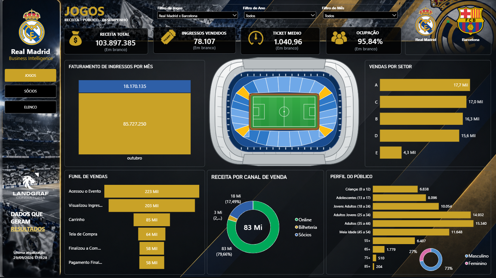
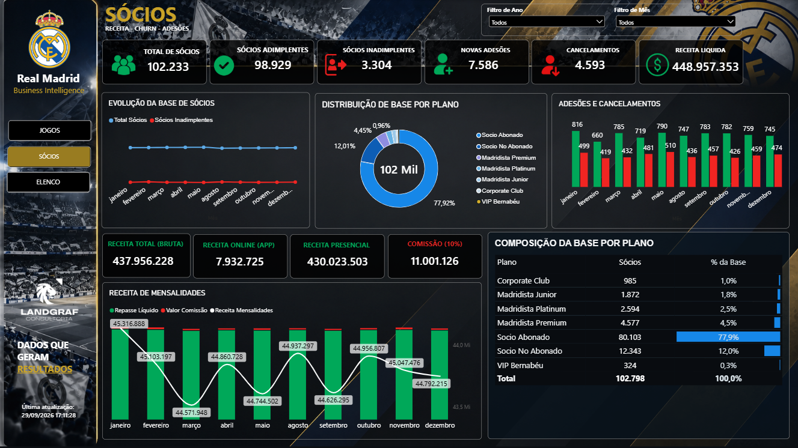
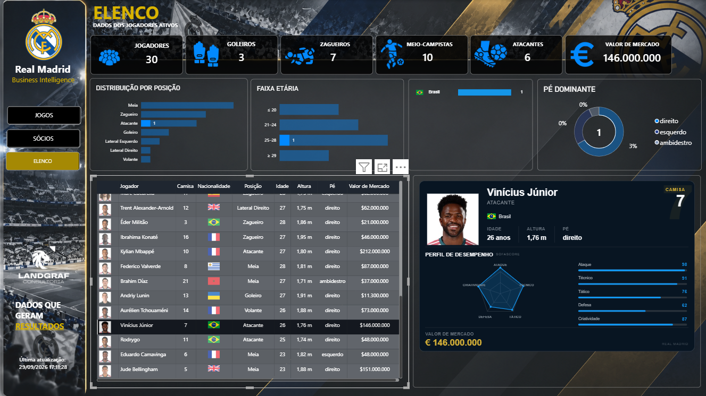

# Football Business Intelligence | Power BI


> A Business Intelligence solution designed to transform football operational data into an interactive analytical environment using Microsoft Power BI.

> Uma solução de Business Intelligence desenvolvida para transformar dados operacionais do futebol em um ambiente analítico interativo utilizando Microsoft Power BI.

---

# 🇺🇸 English

## Overview

This project is a Football Business Intelligence solution developed in Microsoft Power BI.

The objective was to transform operational and performance data into an analytical environment capable of supporting decision-making across different areas of a football organization.

The solution combines data modeling, DAX, Power Query, interactive visualizations, dynamic HTML components and custom SVG-based graphics.

The project was designed as a portfolio case to demonstrate both technical Power BI capabilities and the application of Business Intelligence concepts to a real-world football context.

---

## Business Context

Football organizations generate large volumes of data across multiple areas, including:

- Matches
- Ticket sales
- Stadium occupancy
- Revenue
- Memberships
- Players
- Squad composition
- Player characteristics
- Market value
- Performance attributes

The challenge was to organize these different data domains into an analytical structure that allows users to investigate performance through interactive dashboards rather than isolated spreadsheets or static reports.

---

## Project Objectives

The main objectives of the solution were:

- Consolidate football-related information into a structured BI environment
- Create an analytical data model suitable for Power BI
- Develop reusable DAX measures
- Analyze match and ticket performance
- Monitor stadium occupancy
- Analyze membership performance
- Analyze the active squad
- Create dynamic player profiles
- Provide interactive visual exploration
- Develop custom visual components using HTML and SVG
- Transform raw data into actionable business information

---

# Dashboard Preview

## 01 — Matchday Analytics


The Matchday page provides an overview of match-related information and stadium performance.

---

## 02 — Matchday — Selected Game



When a match is selected, the dashboard dynamically updates its contextual information, including team logos and match-specific data.

The stadium visualization also works as a data-driven heatmap, allowing sector-level performance and occupancy to be visually explored.

---

## 03 — Membership Analytics



The membership analysis provides visibility into membership performance, revenue and related indicators.

---

## 04 — Squad Intelligence — Overview


The Squad Intelligence page provides an overview of the active squad, including:

- Player distribution by position
- Age groups
- Nationalities
- Dominant foot
- Market value
- Player-level information

---

## 05 — Squad Intelligence — Player Detail



The player detail experience provides a contextual profile for the selected player, including:

- Player image
- Shirt number
- Position
- Nationality
- Age
- Height
- Dominant foot
- Market value
- Performance attributes
- Dynamic visual analysis

---

## 06 — Interactive Daily Sales Tooltip


An interactive tooltip designed to provide additional sales information without requiring a separate analytical page.

---

# Key Features

## Matchday Intelligence

- Match-level analysis
- Ticket sales analysis
- Stadium occupancy
- Revenue analysis
- Revenue by stadium sector
- Dynamic team logos based on match selection
- Data-driven stadium heatmap visualization
- Interactive filtering

## Membership Intelligence

- Membership revenue analysis
- Membership plan analysis
- Cancellation analysis
- Membership performance monitoring

## Squad Intelligence

- Active squad analysis
- Player profile analysis
- Position distribution
- Age distribution
- Nationality analysis
- Dominant foot analysis
- Player market value
- Player performance attributes

## Interactive Experience

The report incorporates several interactive and custom-built components, including:

- Cross-filtering
- Dynamic player profiles
- Dynamic team logos
- Dynamic nationality visualization
- Dynamic HTML components
- SVG-based visualizations
- Interactive tooltips
- Context-aware KPIs
- Data-driven stadium visualization

---

# Technical Architecture

The solution was developed using a structured Power BI analytical approach, separating data preparation, data modeling and analytical calculations.

### Data Preparation

Power Query was used to prepare and transform source data before loading it into the analytical model.

Main activities include:

- Data cleaning
- Data type standardization
- Attribute normalization
- Table preparation
- Analytical dimension preparation
- Fact table preparation

### Data Modeling

The model was structured around dimensions and fact tables to support:

- Match-level analysis
- Player-level analysis
- Sector-level analysis
- Membership analysis
- Time-based analysis
- Cross-filtering
- Reusable calculations

### Analytical Layer

DAX measures were developed to support the analytical logic of the report, including:

- Ticket sales
- Stadium occupancy
- Revenue
- Average ticket price
- Player counts
- Position analysis
- Age analysis
- Nationality analysis
- Market value
- Player attributes
- Dynamic visual components

---

# Technology Stack

| Technology | Application |
|---|---|
| Microsoft Power BI | Data modeling, visualization and reporting |
| DAX | Analytical calculations and KPIs |
| Power Query / M | Data transformation and preparation |
| HTML | Custom visual components |
| SVG | Custom graphical visualizations |
| Excel | Source data preparation |

---

# Advanced Power BI Features

The project demonstrates several Power BI development techniques beyond standard visual configuration.

### Dynamic Visual Logic

DAX measures are used to control visual behavior according to the current filter context.

Examples include:

- Dynamic player profiles
- Dynamic team logos
- Dynamic nationality analysis
- Dynamic player attributes
- Context-aware KPIs

### Custom HTML Components

HTML-based components were developed to create customized analytical interfaces that go beyond the standard Power BI visual library.

### SVG Visualizations

SVG was used to create custom graphical elements and data-driven visual components.

### Stadium Heatmap

The stadium visualization was designed as a data-driven representation of sector performance, allowing the user to visually identify differences between stadium sectors.

---

# Repository Structure

```text
football-business-intelligence-powerbi/
│
├── data/
│   └── README.md
│
├── documentation/
│   ├── README.md
│   ├── data-model.md
│   ├── dax.md
│   └── power-query.md
│
├── report/
│   ├── README.md
│   └── Real_Madrid_Business_Intelligence.pbit
│
├── screenshots/
│   ├── 01-matchday.png
│   ├── 02-matchday-selected.png
│   ├── 03-membership.png
│   ├── 04-squad-overview.png
│   ├── 05-squad-player-detail.png
│   ├── 06-daily-sales-tooltip.png
│   └── README.md
│
├── .gitignore
└── README.md
